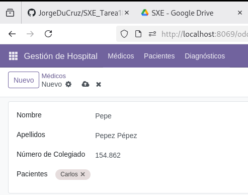
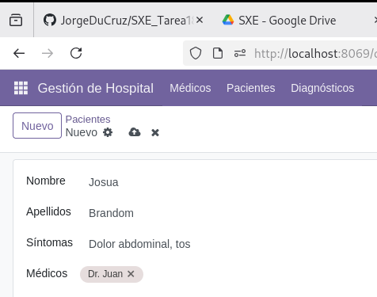

## Instalación del módulo

Como se puede ver, el módulo esta,efectivamente, instalado.

## Médicos

Aquí hay un ejemplo de como se ven los datos de los médicos

Y aquí como se introducen los datos. No hay ninguna necesidad de que permita agregar un paciente, 
pero es para que puedas verificar rápidamente que si estan relacionados entre si.

## Pacientes

Aquí hay un ejemplo de como se ven los datos de los pacientes

Al igual que con los médicos puedes introducir el nombre del médico solo para que puedas ver la relación.

## Diagnosticos

Aquí hay un ejemplo de como se ven los datos de los diagnosticos

Y aquí como se introducen los datos.