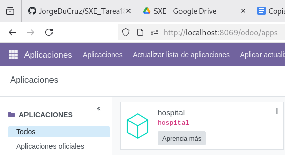
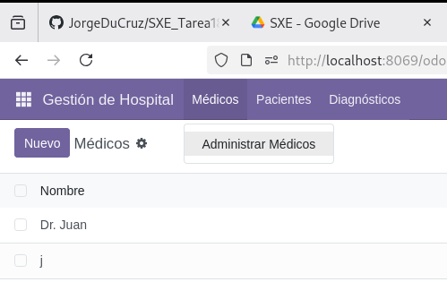
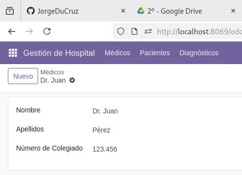
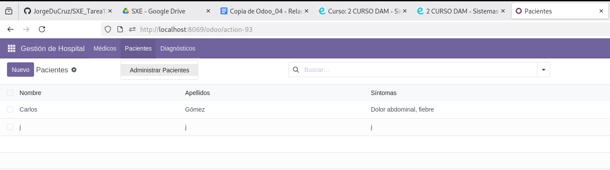
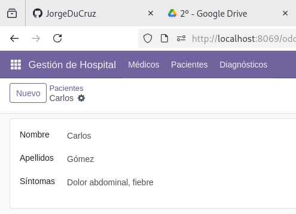
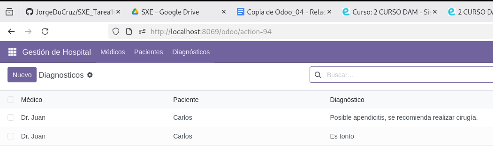
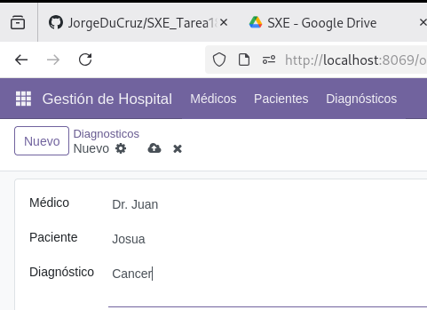

## Instalación del módulo

Como se puede ver, el módulo esta,efectivamente, instalado.

## Médicos

Aquí hay un ejemplo de como se ven los datos de los médicos

Y aquí como se introducen los datos.

## Pacientes

Aquí hay un ejemplo de como se ven los datos de los pacientes

Y aquí como se introducen los datos.

## Diagnosticos

Aquí hay un ejemplo de como se ven los datos de los diagnosticos

Y aquí como se introducen los datos.